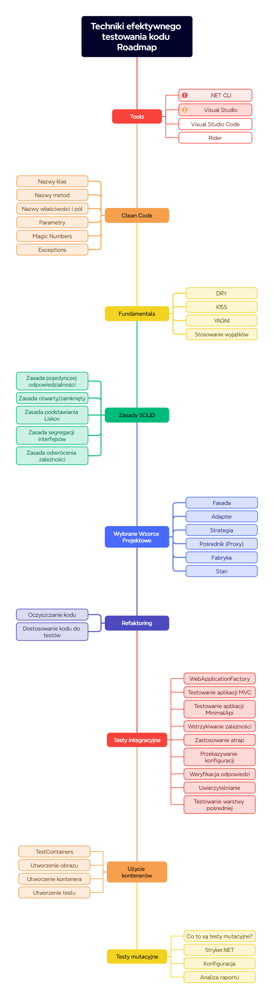

# Przykłady ze szkolenia

## Wprowadzenie

Witaj w repozytorium z materiałami do szkolenia **Techniki efektywnego testowania kodu**.

Do rozpoczęcia tego kursu potrzebujesz następujących rzeczy:

1. [.NET 8 SDK](https://dotnet.microsoft.com/en-us/download/dotnet/8.0).

## Przygotowanie
1. Sklonuj repozytorium Git
```
git clone infoshareacademy-accenture-tdd-efecting
```
2. Zbuduj
```
cd src
dotnet build
```

## Zakres

